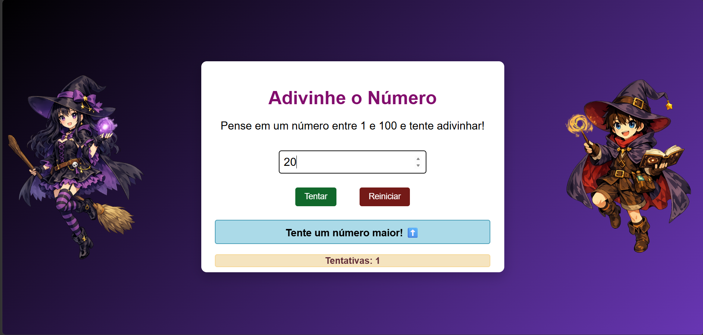

# 🎮 Número Misterioso

Jogo de adivinhação feito com HTML, CSS e JavaScript. O objetivo é descobrir um número secreto entre 1 e 100.

---

## 📸 Preview do jogo

  

---
## 🔗 Acesse o Jogo aqui:
https://gleyce-gomes.github.io/jogo-do-adivinhe/

## 📌 Sobre

Criei esse projeto para treinar lógica de programação e interação com o usuário.

O jogo gera um número aleatório e o jogador precisa adivinhar com base nas dicas de maior ou menor.

---

## 🚀 Funcionalidades

- Número aleatório de 1 a 100  
- Validação de entrada  
- Dicas (maior ou menor)  
- Contador de tentativas  
- Botão de reiniciar  
- Funciona com tecla Enter  
- Layout responsivo  

---

## 🛠️ Tecnologias

- HTML  
- CSS  
- JavaScript  

---

## 🎯 Como jogar

Digite um número entre 1 e 100 e tente acertar o número secreto.

O jogo vai te dar dicas:
- ⬆️ Maior  
- ⬇️ Menor  

Continue tentando até acertar.
